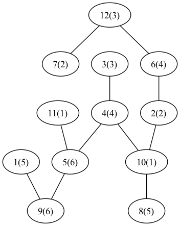
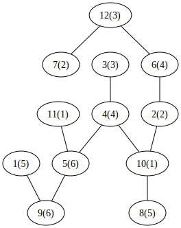

## Task E. No Palindromes
case analysis.

1. S is not palindrome, obvious Yes
2. S consists of same character, then Answer is No
3. Let P = lowest position where $A_P != A_1$, $S_1$ = A[1..P], and $S_2$ = A[P+1...N]. if $S_2$ is not palindrome, then we are done. Else S = AbAb..AbA, where A = $\underbrace{a...a}_{P-1}$.
   1. if S = abab...aba, Answer is No
   2. if S = AbA, Answer is None
   3. Else, Answer is Yes, and $P_1$ = Aba, left is $P_2$
   4.
<table>
    <tr><th>P: lowest p where $A_p != A_1$</th><th>Second part is palindrome?</th></tr>
    <tr><td>2</td><td>YES</td></tr>
</table>

<!-- 
 -->

<!-- <a href="https://codeforces.com/contest/2067/problem/F">2067F - Bitwise Slides</a> -->

[2067F - Bitwise Slides](https://codeforces.com/contest/2067/problem/F)

key observation: a $xor$ a = 0

f[i-1,x]: total of status of (x, x, $pref_{i-1}$), i.e. at least two of them are equal

f[i,x] = f[i-1, x] + f[i-1, $pref_{i}$]
f[i, $pref_i$] = f[i - 1, $pref_i$]
